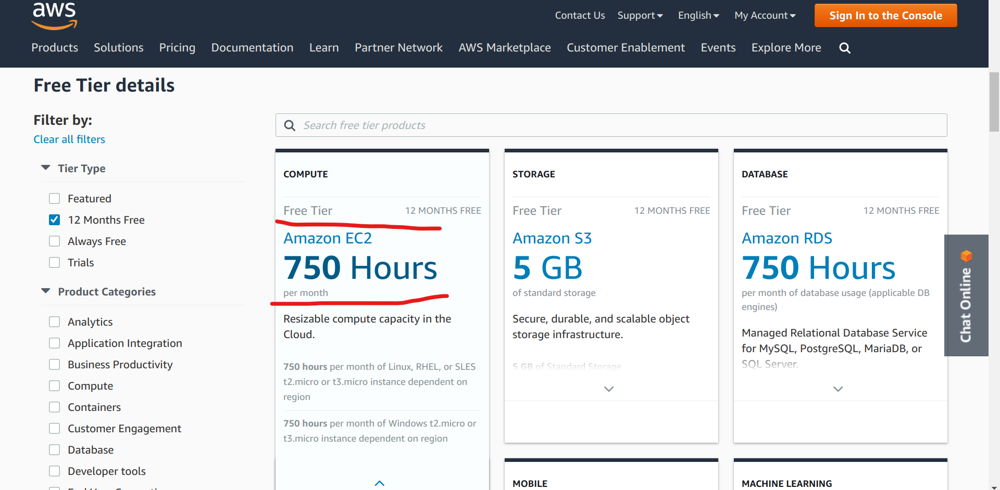
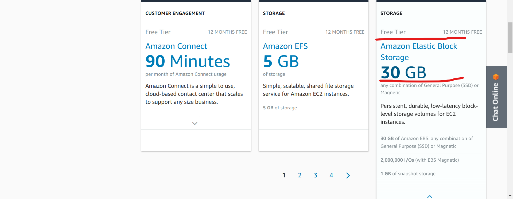
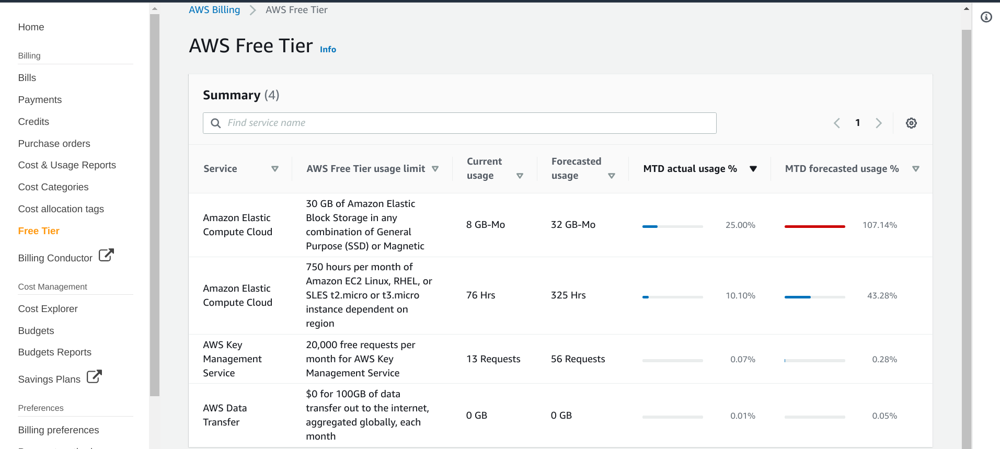
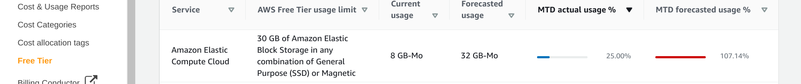
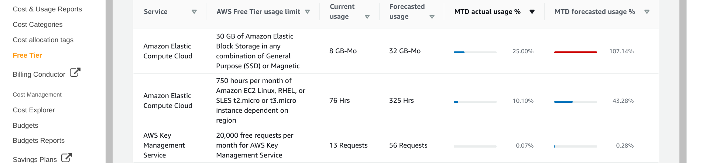
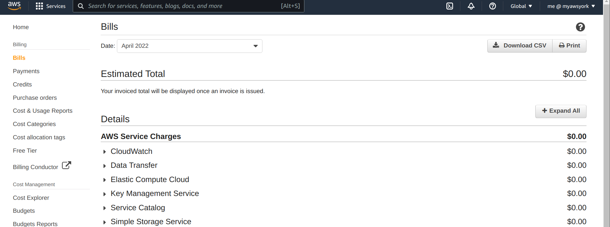
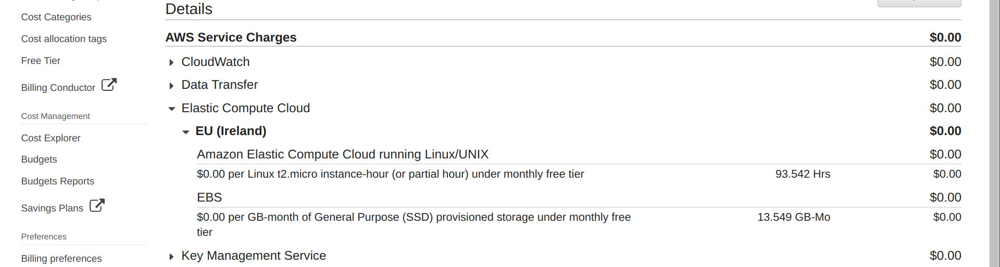
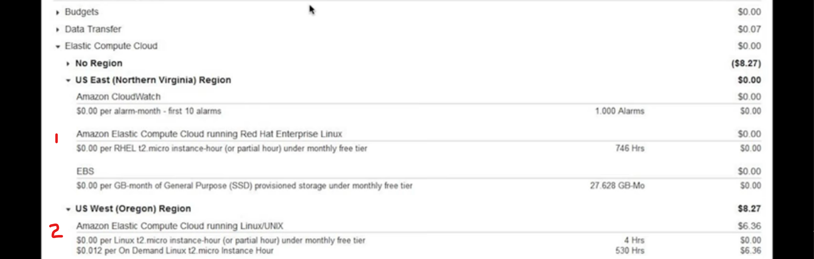

> ## Prerequisites
> You will need to login to your AWS IAM user account to follow the third part of this episode; the instructions to login are in the lesson [Create and manage your AWS instance](https://cloud-span.github.io/create-aws-instance-2-manage-instance/01-create-aws-instance/).
{: .prereq}

# Introduction
The [AWS Free Tier](https://aws.amazon.com/free) covers more than 100 AWS services including the compute and storage services you used to create your instance in the previous lesson. Service usage covered by  the AWS Free Tier has limits, however, both in time and in capacity, and you will be billed as soon as you surpass these limits.  The AWS Free Tier has three schemes (plans /offers): 
- *12 months free*
- *Free Trials*
- *Always free*

The *12 months free* scheme lasts for 12 months from the moment you opened your account and covers typical IT services such as servers, storage and networking. This scheme will cover the instance you created in the last lesson **but only** if you created it by combining the Genomics AMI with the instance type t2.micro; if so, you will not be billed for one year.

The *Free Trials* scheme covers somewhat more specialised services such as machine learning. It is valid either for short-term periods of 1-3 months or for a number of service invocations. Free Trials start from the date you activate (start using) a particular service and will terminate after the specified time period expires or the number of service invocations is reached; you will then be billed for any usage of the service. 

The *Always free* scheme covers a variety of services some of which have an auxiliary role. For example, you will recall that in using your instance you must use an encrypted key file to login to your instance and, through the program `ssh`, you enter shell commands and get data/results that are transferred between your local computer and your instance. In so doing, you are using two *always-free* services: the *AWS Key Management Service* to securely access your instance and the *AWS Data Transfer* service to tranfer data into and out from your instance. These services have always-free monthly quotas of 20,000 requests and 100 GB respectively. If you surpass those quotas in a month, you will be billed. 

> ## Topics covered:
>
> 1. [**The cost of your instance (no Free Tier)**](#1-the-cost-of-your-instance-no-free-tier).\
> You will learn what AWS services are used by your instance and the cost of your instance once the Free-tier period is finished.
>
> 2. [**Free-tier quotas related to your instance**](#2-free-tier-quotas-related-to-your-instance).\
> You will learn the Free-tier quotas related to your instance and whether they are applicable to your instance which depends on the configuration of your instance.
>
> 3. [**Check your service use as compared to Free-tier quotas**](#3-check-your-service-use-as-compared-to-free-tier-quotas).\
> You will learn how to check your service usage and how service usage is measured and billed.
>
> 4. [**Understanding your bills**](#4-understanding-your-bills).\
> You will learn how bills are organised and how billing is applied.
{: .callout}

# 1. The cost of your instance (no Free Tier)
The instance you created in the previous lesson makes use of these services:
- Amazon Elastic Compute Cloud (EC2) 
- Amazon Elastic Block Storage (EBS) 
- AWS Key Management Service (KMS) 
- AWS Data Transfer (DT) service 

The cost of your instance depends on the cost of those services and how much use your instance makes of each service. You may not incur any cost if the Free Tier is applicable but we will explore this scenario in the next section. 

In this section we are going to find out the cost your instance will incur when the Free Tier one-year period has finished, based on the use that your instance makes of those services. In so doing, we will present some data regarding those costs which were gathered from Amazon Web Service pages in May 2023. Note that the costs presented are those for AWS Region of Ireland.

### Compute (EC2) cost
The compute cost of your instance is determined by the **instance type** you chose in creating your instance. The table below shows the cost per hour, number of processors (vCPUs), and main memory size of the instance types so far mentioned in the course (there many more instance types). The data in the table was taken from the [Amazon EC2 On-demand Pricing](https://aws.amazon.com/ec2/pricing/on-demand/) page.

> ## The cost and specifications of AWS instance types relevant to this course
>
> | Instance type | On-demand hourly rate | vCPUs | Main memory | Comments
> |---------------|-------------|---------------|----|----|----|----|
> | t2.micro |	$0.0126 | 1 | 1 GiB | Free tier eligible --- suggested for your Genomics instance |
> | t3.micro |	$0.0114	| 2 | 1 GiB | Free tier eligible --- only if t2.micro is not available in the AWS region where the instance is created |
> | t3.small |	$0.0228	| 2 | 2 GiB	| Used for Cloud-SPAN Genomics workshop instances |
> | t3.2xlarge | $0.3648 |	8 |	32 GiB | Used for Cloud-SPAN Metagenomics workshop instances |	
{: .callout}

Based on the cost per hour in the table, the compute cost per day and per month in US dollars of the instance you may have created in the previous lesson will be:

| AMI - instance type | Compute Cost per day | Compute Cost per month |
|---------------|-------------|---------------|
| **Genomics - t2.micro** instance | $**0.3024** = $0.0126 x 24 hours | $**9.072** = $0.0126 x 24 hours x 30 days |
| **Genomics - t3.small** instance | $**0.5472** = $0.0228 x 24 hours | $**16.416** = $0.0228 x 24 hours x 30 days |
| **Metagenomics - t3.2xlarge** instance | $**8.7552** = $0.3648 x 24 hours | $**262.656** = $0.3648 x 24 hours x 30 days | 

> ## Your instance incurs **compute cost** only when it is running.
> Compute cost is billed per second, with a minimum of 60 seconds, see the [Amazon EC2 pricing](https://aws.amazon.com/ec2/pricing/) page and scroll down to the heading "Per-second billing". Thus even though AWS presents the cost per hour, you will be charged for the minutes your instance is running. 
{: .callout}

### Storage (EBS) cost
The storage cost of your instance is determined by the **size** of the **Cloud-SPAN AMI** you chose in creating your instance. The size of the Genomics AMI is 30 GB, while the size of both Metagenomics AMIs is 240 GB.

There are different types of EBS storage, each type with a different price, as described in the [Amazon EBS pricing](https://aws.amazon.com/ebs/pricing/) page. 

The type of storage used by all Cloud-SPAN AMIs is *General Purpose SSD (gp2) Volumes* and its cost is US $**0.11** per GB-month of provisioned storage. That is:

*Storage cost* &nbsp; = &nbsp; 0.11 &nbsp; x &nbsp; provisioned_storage_size &nbsp; x &nbsp; time_units_used &nbsp; / &nbsp; total_time_units_in_month

Thus the storage cost per day and per month in US dollars of the instance you may have created in the previous lesson will be:

| AMI - storage size | Storage Cost per day | Storage Cost per month |
|---------------|-------------|---------------|
| **Genomics - 30 GB** storage  | $**0.11** = $0.11 x 30 GB x 24 hours /(24 hours x 30-day month)| $**3.30** = $0.11 x 30 days |
| **Metagenomics - 240 GB** storage | $**0.88** = $0.11 x 240 GB x 24 hours/(24 hours x 30-day month)  | $**26.4** = $0.88 x 30 days | 

> ## Your instance incurs **storage cost** while it exists:
>  You need to delete (terminate) your instance to stop incurring storage cost. Storage costs are billed by the second too, with a minimum of 60 seconds. We used hours as the time unit in the calculations above to simplify them but AWS will use seconds to bill your storage cost. 
{: .callout}

### Key management service (KMS) cost
The key management service is related to the login keys you must use to be able to login to your instance. The cost is US $0.03 per 10,000 requests as described in the [AWS Key Management Service Pricing](https://aws.amazon.com/kms/pricing/) page. 

However, KMS is a Free tier *Always free* service with 20,000 requests per month calculated across all Regions that the service is available. Thus only if you exceed 20,000 login requests you will be charged.

### Data transfer (DT) cost
The data transfer service has to do with data you transfer **from your instance** out to somewhere in the Internet including your laptop or desktop, and **into your instance**. You use the DT service when you use the programs `ssh`, `scp`, `curl`, `wget`.

There is **no cost** for **data transfers into** your instance. 

For data you transfer from your instance, DT is a Free tier *Always free* service with "100GB of data transfer out to the internet free each month, aggregated across all AWS Services and Regions (except China and GovCloud)".

Once you exceed the free 100GB, you will be charged as follows:
- US $0.09 per GB for the first 10 TeraBytes (TB) per month, 
- US $0.085 per GB for the next 40 TB per/month
- ... 
 
See more details on the [Amazon EC2 On-Demand Pricing](https://aws.amazon.com/ec2/pricing/on-demand/) page, scrolling down to "Data Trasnfer".

### The total monthly cost of your instance --- no Free Tier
For most practical purposes, we can assume the KMS and DT services are free. You will rarely exceed the Free Tier quotas of these services, 20,000 requests and 100GB.  

Thus the total monthly cost of your instance considering only the EC2 compute cost and the EBS storage cost will be: 

| AMI - instance type - storage size | Compute Cost /day | Compute Cost /month | Storage Cost /month | Total Cost /month |
|---------------|-------------|---------------|---|----| 
| Genomics - t2.micro - 30 GB | $**0.3024** | $**9.072** | $**3.30** | $**12.372** |
| Genomics - t3.small - 30 GB | $**0.5472** | $**16.416** | $**3.30** | $**19.716** |
| Metagenomics - t3.2xlarge - 240 GB | $**8.7552** | $**262.656** | $**26.4** | $**289.056** |

# 2. Free-tier quotas related to your instance
These are the Free Tier quotas that **may** apply to your instance:
- Amazon Elastic Compute Cloud (EC2) --- 12-months free with a monthly quota of 750 hours
- Amazon Elastic Block Storage (EBS) --- 12-months free with a monthly quota of 30 GB-month
- AWS Key Management Service (KMS) --- always-free 20,000 requests per month
- AWS Data Transfer (DT) service --- always-free 100 GB per month

We have already discussed the KMS and DT service quotas in the previous section. 

This section will describe in detail the applicability of the EC2 and EBS service quotas. Briefly, you can only benefit of these service quotas if your instance uses a t2.micro instance type and has up to 30 GB storage. That is, if you created your instance with the Genomics AMI and the t2.micro instance type, **you will not incur any cost** for one year from the time you opened your account.  If you created your instance otherwise (either using a different instance type with the Genomics AMI or using any of the Metagenomics AMIs), **you will incur some cost**.

### The compute service (EC2) Free-tier details

The EC2 Free Tier is described in the [AWS Free Tier](https://aws.amazon.com/free) page ---  scroll down until you see the heading **Free Tier Details** on the left, see the page below (no need to login to your account yet).   

In the page below we have checked the Tier Type filter **12 Months Free** (on the left) and hovered the mouse cursor over the box labelled **Amazon EC2 750 Hours** so that all the information details in the box are uncovered --- we added the two red lines for convenience. 

{: width="900px"}

You can read in that box that: 
1. You have 750 hours **per month**, which amounts to 750/31 days = 24.19 hours for each day in a month. 
2. You can use those hours running **Linux**, **RHLS** (Red Hat Enterprise Linux), and **SLES** (Suse Linux Enterprise Server) with instances of type **t2.micro**, or t3.micro **but only** if t2.micro is not available in the AWS region where you create your instance.  
3. You can have other 750 hours per month to run Windows with instances of type **t2.micro**, or t3.micro but only if t2.micro is not available ..

Clearly, point (1) above means that you can run a t2.micro instance **continuously** until your Free Tier expires without incurring any cost, but see notes below. 

> ## Remember this:
> - The 750 hours for Linux instances cannot be combined with the 750 hours for Windows intances.  
> - The 750 hours for Linux and Windows instances **apply globally to your account**, not to a region and not to an instance. That is, the 750 hours in a month are divided among the number of Linux (or Windows) t2.micro instances that you run in the month in any region. If you run two or more t2.micro instances continuously for one month or longer, you will incur some cost.  
> - Unused hours in a month **do not roll over** to the next month.
{: .callout}

### The storage service (EBS) Free-tier details

To see the details of the EBS Free Tier, scroll further down the AWS Free Tier page until you see the box labelled **Amazon Elastic Block Storage 30GB** and then hover the mouse cursor on the box --- it should look like below:

{: width="900px"}

You can see in the page that: (1) you can use up to 30GB of EBS storage for 12 months; (2) EBS storage can be **SSD** (Solid State Drive) storage or magnetic (previous generation) storage with up 2 million Input/Ouput (I/O) operations; and (3) you have up to 1GB of snapshot storage. 

The Genomics AMI uses 30 GB of SSD storage and the Metagenomics AMIs 240 GB of SSD storage. Thus only instances created with the Genomics AMI are Free-tier eligible.

Snapshots are used for backups but your instance does not perform any backups.

> ## Remember this:
> - The Free Tier 30 GBs EBS storage applies to your account. If you created your instance with the Genomics AMI, it is using that many GBs, and you cannot use more storage of any type (SSD or magnetic) without incurring some cost. 
> - Of those 30 GBs in an instance created with the Genomics AMI, 12 GBs are free for data and to install other software applications.
{: .callout}

# 3. Check your service use as compared to Free-tier quotas

AWS bills users **monthly** and Free-Tier eligible services have **monthly** quotas or limits. You must not surpass these quotas in each month if you don't want to incur costs while your Free Tier is active. To find out how much in the current month you have used of your monthly Free-Tier allowance, login to your IAM account and go to the **Billing Dashboard** using the drop-down menu *user@accountalias* (or *user@accountnumber* if you did not create an alias) on the top right. Then, on the navigation pane on the left, under Billing, click on **Free Tier**. This will show the Free Tier usage summary table.

The table shows the usage in the current month of each Free-Tier eligible service in your account. There is a row for each service and the columns give: the type of **Service**, the **AWS Free Tier usage limit**, your **Current usage** for the month, the  **Forecasted usage** for the month, the  **MTD actual usage** for the month as a percentage of the service monthly Free-Tier limit, and the service **MTD Forecasted usage** for the month. **MTD** stands for Month-To-Date.

Any service created or used in a month will contribute to the corresponding service usage of the month, even if the service is deleted early in the month.

The first two rows correspond to the **EBS storage** and the **EC2 compute** services presented earlier. Note that EBS storage ("30 GB of Amazon Elastic Block Storage") is of type *Amazon Elastic Compute Cloud*. This storage is part of your instance and will be deleted when your instance is deleted. You can detach the storage before deleting your instance if you want to preserve it. Note that there are other types of AWS storage such as S3 (Simple Storage Service) which you can use without attaching them to an instance. 

The third row corresponds to the login AWS **Key Management Service** which allows you to securely access your instance based on the login key pair you created when you created your instance. The Key Management service is an *always-free* service with up to **20,000 requests free** each month that apply globally to your account. That is plenty of requests. You don't really need to be concerned about it.

The fourth column corresponds to the AWS **Data Transfer** service which allows you to tranfer data into and out of your instance and any other services. It is *always-free* to transfer data out with up to **100 GB free** per month across all services you are using.  Data transfers **into** your instance/s (or other AWS services) are **free** --- but you may pay for storing the data; for example, if you transter data into your instance and your Free Tier has expired, you will be paying for EBS storage. 

### **Notes on service usage**

#### **Usage of EBS storage is measured in GB-Month**'s (GB-Mo in the table):

Under the free tier you have 30 GB-Months per month for 12 months. This means you can run one 30 GB instance for a month or one 60GB instance for half a month or two 30 GB instances for half a month. This is the case whether there are 28, 30 or 31 days per month so that the per day rate varies depending on the month.

> ## Example
> If you had two 30 GB instances running you can use them for
> -  30 / (2 x 30) * 28 days = 14 days in February
> -  30 / (2 x 30) * 30 days = 15 days in April
> -  30 / (2 x 30) * 31 days = 15.5 days in March
> 
> If you had a 50 GB instance running you can use it for
> -  30 / 50 * 28 days = 16.8 days in February
> -  30 / 50 * 30 days = 18 days in April
> -  30 / 50 * 31 days = 18.6 days in March
{: .callout}

Note that AWS uses actually seconds for calculations but we use hours here to simplify. See [EBS pricing](https://aws.amazon.com/ebs/pricing/).

> ## Important!
> If you decide to run more than one 30 GB instance (e.g., one 50 GB or two 30 GB) for a shorter time you must terminate your instance by the the time you reach the 30 GB-Month limit.
{: .prereq}

Let's see a billing example assuming your 12-month Free Tier has expired.

> ## After your 12-month Free Tier has expired
> In the Ireland region, the cost of EBS storage is US $ 0.11 per GB-Month (in April 2022).
>
> This means you pay $ 0.11 per GB per month.
> 
> If you create a 30 GB instance and delete it after 8 days you will pay:
> -  0.11 * 30 GB * 8/28 = $0.9428 in February
> -  0.11 * 30 GB * 8/30 = $0.88 in April
> -  0.11 * 30 GB * 8/31 = $0.8516 in March
{: .callout}

#### **Understanding "MTD actual usage" and "MTD forecasted usage"**

**MTD actual usage** is the total usage of a service in the current month, from the beginning of the month up to the last day before the current date. It is shown in the table as a percentage of the service Free-Tier quota to more easily appreciate how much of that quota has been used. It is computed thus for any service:

*service Current usage / service Free-Tier quota * 100*

> ## Example MTD usage calculations:
> *service Current usage / service Free-Tier quota * 100*
> 
> The Free-Tier quota of Elastic Block Storage (EBS) is 30 GB per month. If your usage of EBS so far this month is 8 GB-Mo then you have used:
>           8 GB-Mo / 30 GB * 100  =  26.6%
>
> The Free-Tier quota of EC2 is 750 hours per month. If your usage of EC2 so far this month is 76 hours then you have used:
>          76 hours / 750 hours * 100 = 10.13%
>
> The Free-Tier quota of Key Management Service (KMS) is 20,000 requests per month. If your usage of KMS so far this month is 13 requests then you have used:
>           13 requests / 20,000 requests * 100 = 0.065%
>  
{: .callout}

Note that the Current Usage values are rounded for display but the exact values are used in calculation so you may see small differences between the table and your own calculations.

**MTD forecasted usage**  let's you know whether your current rate of use excceds that allowed under the free-tier.

> ## Remember this:
> If an **MTD forecasted usage** value in the AWS Free-Tier Summary table is higher than 100%, you should reduce your use of it. 
>
> If you have not changed the configuration of your instance, you should not exceed the free-tier limit and the instance will not incur a cost even if you don't stop or delete it. However, if you change its configuration by:
> - adding EBS storage or 
> - using an instance type with more capacity
> 
> Then you _could_ exceed the limit if you do not make adjustments.
> For example, if you double the EBS storage you will need to delete your instance half way through the month to stay within the limit. 
> Note: This course does not cover how to increase the EBS storage of your instance.
{: .callout}

# 4. Understanding your bills
You will be billed on the 3rd of 4th of each month but can access your bill any time in the Billing Dashboard. 
-  Login to your IAM account and go to the Billing Dashboard using the drop-down menu **user@accountalias** (or **user@accountnumber** if you did not create an alias) on the top right. 
-  Click **Bills** under Billing on the left

This will show a summary of the current month's bill. A drop-down menu, **Date** enables you access previous bills. 

In the figure below we have expanded the drop-down menu of the **Elastic Compute Cloud** (EC2) service. Service usage and cost is grouped by region. Our account shows only the Ireland region for EC2 as we are using EC2 in that region only (below is an example showing multiple regions).

Note that we have used 93.542 hours of the EC2 service and 13.549 GB-Month's of the EBS storage service, yet the incurred cost for each service is $0.00 because what we have used of each service so far within the month is within the monthly Free-Tier quota of each service. 

Had our Free Tier expired, the costs shown in the table would be: 
- 93.542 hours *times* $0.0126 USD per hour of t2.micro instance = **$1.178** for the EC2 service so far in the month, and 
- 13.549 GB-Months *times* $0.11 USD per GB-Month = **$1.49** for the EBS storage service so far in the month. 

The figure below shows a billing example for EC2 service usage involving two regions and two  (Free-Tier eligible) t2.micro instances and the Free Tier being active but exceeded. Recall that each account has Free-Tier 750 hours per month of t2.micro instance service. 

The **instance** in the Northen Virginia region (1 in red in the figure below) ran for 746 hours in the month with no cost, leaving 750 - 746 = 4 Free-Tier hours still to be used. 

The **instance** in the Oregon region (2) ran for 534 hours. Of these hours, 4 incurred no cost as the 4 Free-Tier hours still to be used were applied. Thus only 530 hours were actually billed for a cost of 530 hours *times* $0.0125 USD per hour of t2.micro instance = **$6.36**.

 

