> ## Prerequisites
> You need to read the previous episode [The AWS Free Tier](../01-free-tier) for you to be able to follow the third part of this episode.
{: .prereq}

# Introduction
> This episode provides an overview of these topics:
>
> 1. **The AWS Cloud Credit for Research (ACCR) programme**:\
You will learn about the types of projects supported by ACCR, eligibility criteria, awards and scope, and the application process.
>
> 2. **Preparing your application to ACCR**:\
You will learn the structure of your research project as expected by AWS and the evaluation criteria for you to organise your project content accordingly.
>
> 3. **Getting the cost estimate of your project**:\
This section will show you how to get the cost estimate of your project which you must include with your application.
{: .callout}

# 1. The AWS Cloud Credit for Research (ACCR) programme
[ACCR](https://aws.amazon.com/government-education/research-and-technical-computing/cloud-credit-for-research/) supports the public sector in the adoption of cloud technologies under research and training projects. It provides funding in the form of credit that can only be used to pay for the cost of using AWS services under such projects. 

### Types of projects
The type of projects considered under ACCR include:

- *Proof of concept or benchmark tests*:\
That evaluate the efficacy of moving research workloads or open data sets to the cloud.

- *Development of repeatable, sharable solutions*:\
That build cloud-hosted publicly available science-as-a-service applications, software, or tools to facilitate a community's future research.

- *Advanced workshops or tutorials*:\
That train a broader community on the use of cloud for research workloads.

ACRC "does **not** support administrative workloads, operational projects, or ongoing projects".

### Eligibility
ACRC is open to full-time faculty, full-time researchers, and students at an accredited research institution. Graduate, post-graduate and PhD students are eligible. ACCR is intented for relatively long (up to one year), research-oriented projects that "fall outside of course requirements". Student awards can be up to a maximum of US $5,000.00 --- faculty and researcher awards have no limit.

(Undergraduate students who wish to use AWS in courses or coursework can apply to the [AWS Educate](https://aws.amazon.com/education/awseducate/) programme which is free.)

### Awards and scope

While student awards can be up to a maximum of US $5,000.00, the awarded amount will depend on your research proposal and the AWS service usage requirements as documented in your application. You must also specify in your application what AWS services you will use and for how long --- more on this below.

Once you receive an award, it is referred to as **AWS Promotional Credit** or **Promotional Credit**.  The Promotional Credit you receive may be **less** than what you asked in your application. This may be because AWS is "encouraging a different cost model leveraging *spot instances* or providing funding for a smaller, initial proof of concept portion of a new project".

Promotional credit **has some restrictions in use**. Usage of EC2 services is **only covered** under the pricing schemes *pay-as-you-go* (also known as *on-demand*) and *Spot Instances* only. Also, Promotional Credit **cannot be used** to pay for **previous charges** or charges for any of the folllowing AWS services: "*Amazon Mechanical Turk, AWS Managed Services, Ineligible AWS Support, AWS Marketplace, AWS Professional Services, AWS Training, AWS Certification, Amazon Route 53 domain name registration or transfer, any Services for mining for cryptocurrency, any other Services as may be designated by your AWS contracting entity, or any upfront fee for any Services such as Savings Plans and Reserved Instances (collectively, “Ineligible Services”). For purposes of this Section 1, “Ineligible AWS Support” means AWS Support (as described on the AWS Site) that is at the Enterprise Support level*". **You will be billed** if you use any of those services. 

Please see other restrictions and guidelines in the [AWS Promotional Credit Terms & Conditions](https://aws.amazon.com/awscredits/).

### The application process at a glance

Once you submit your application, you will receive an automated email confirming your submission from **aws-research-credit@amazon.com** --- check your spam folders. You will also receive an email from that email address with **the outcome of your application** within 30 days of submission but it may take up to 120 days. If your application is **not** successful, you can apply again but you **must revise** your application and not simply resubmitting the unsuccessful one --- see the next topic "2. Preparing your application to ACRC" where some of the evaluation criteria are presented. 

If your application is successful, you will receive Promotional Credit directly applied to your AWS account, usually within 10 business days of the communication, or an email with a *Promotion Code* to redeem in your account. To redeem your Promotion code, go to the **Billing Dashbord**, select **Credits** on the left navigation pane, and then click on **Redeem credit** which will appear at the top right. The screen below will appear.  Enter your Promotion Code and the displayed characters to the security check bock and click on **Redeem Credit** again:  

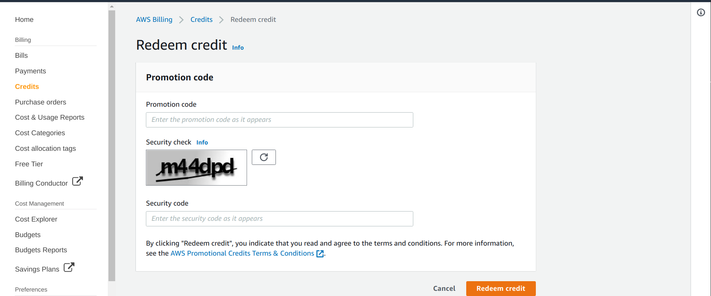 

### Other points you should know

**Acknowledgements**:\
You should acknowledge your ACCR award as "AWS Cloud Credit for Research" in any outcome of your project such as "websites, data sets, repeatable solutions, and publications". 

**How long is Promotional Credit valid?**:\
Promotional Credit expires after one year from the time it is applied to your account or until it is used entirely. Any promotional credit not used after the expiration date is forfeited. Once any of these conditions happen, **your credit card will be charged** for any AWS services you use. Check your credit regularly. "**Refunds will not be issued** for services billed after credit expires or is exhausted". You can also set Billing Alerts through the Billing Dashboard, following the options **Billing Preferences** and then **Manage Billing Alerts**. We don't cover this yet in this course unfortunately. 

**You can submit another application for the same project**:\
If your project runs for longer than planned, you can apply for another ACCR award explaining your project progress and including any outcomes and milestones you have reached.

# 2. Preparing your application to ACCR

To apply for an ACCR award, you will fill and submit the online application form here: [ACRC Application Details](https://pages.awscloud.com/aws-cloud-credit-for-research.html). However, you need to prepare the following beforehand:

- opening your AWS account, as you will need to enter your 12-digit account number 
- write your research project, see guidelines below
- ask somebody to be your Faculty Advisor, as you will need to enter her/his name

You will also need:
- your institution email address
- your phone number

### Writing your research project

Your research project must include the following (from [ACRC Application Details](https://pages.awscloud.com/aws-cloud-credit-for-research.html)):

1. Description of problem to be solved.
2. Proposed Amazon Web Services (AWS) solution (including specific AWS tools, timeline, key milestones).
3. Plan for sharing outcomes (tools, data, and/or resources) created during project.
4. Any potential future use of AWS beyond grant duration by individual research group or broader community.
5. Names of any AWS employees you have been in contact with (this is not a prerequisite for the application).
6. Any AWS Public Data Sets to be used in your research.
7. Keywords to facilitate proposal review.

In preparing you research project consider the following:

"AWS approves applications based on factors such as clearly defined outcomes, potential to disseminate the results and data through sharing a pipeline or software, succinctly defined milestones, the applicability of AWS services within the project scope, and value of AWS Promotional Credit requested suited to the scope of the project (as evidenced by a link from the AWS Pricing Calculator to substantiate the AWS Promotional Credit desired)" [\[Factors AWS considers to determine who receice Promotional Credit\]](https://aws.amazon.com/government-education/research-and-technical-computing/cloud-credit-for-research/faqs/proposal-preparation/).

The evaluation of your project by AWS will focus on "\[**A**\] the reusability of the expected outcome of the project and \[**B**\] on  the demonstrated \[proof of concept\] efficacy of AWS for a research workload".

"Examples of reusable outcomes include publicly available AMIs, code repositories, or reduced data sets. Proof of concept or other pilot projects that explore how well AWS services match with common research workloads are also of interest. These might include benchmarks or use case reports".

Should you need to submit your project again, revise the two subjects above, reusability and proof of concept, before resubmitting.

By all means, see if it is at all possible for your Faculty Advisor to revise your project before you submit it. If so, hand in a full version of the project to your Advisor, covering all the steps 1-7, as you may only have one revision by your Advisor and you want feedback on the entire project if possible.

### Filling the application form

All fields in the ACCR application form are **required** and the filling of most of them is straightforward (single line fields for Name, Account number, etc., and a few date fields and a few drop-down menus).

However, the following two fields require some preparing:
- *Save and Share URL from AWS Pricing Calculator*
- *Project Description*

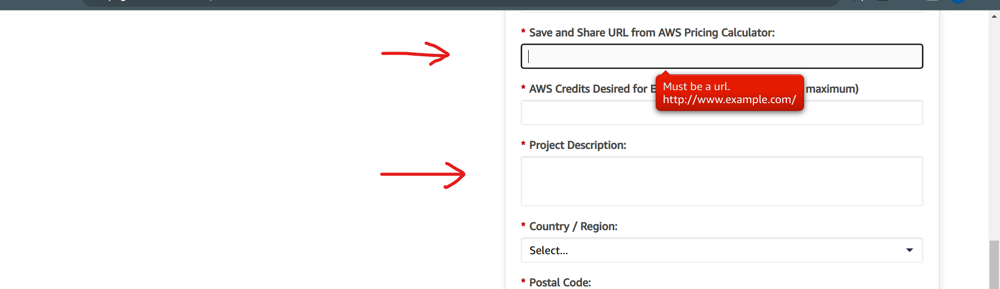 

The field *Save and Share URL from AWS Pricing Calculator*, as shown by the red label in the figure, requires that you enter the URL (web address) of the cost estimate of your project which you need to prepare with the [AWS Pricing Calculator](https://calculator.aws/#/). You will see how to do your cost estimate and get its web address in the next topic "3. Getting the cost estimate of your project".

The field *Project Description* in the figure looks small and will remain so even after you enter the  description of your project, making it difficult for you to see and edit your project. Hence, it is better that you prepare your project with a **plain text** editor, saving  regularly to a file. Once you finish editing your project, copy-paste it into that field. Windows users **should not use Word** as you may end up copying control characters. Use **notepad** instead. Once you copy-paste your project, a vertical scrolling bar will appear to the right of the field Project Description. Scroll to the top and to the bottom to check that the beginning and the end of your project are there.

# 3. Getting the cost estimate of your project

To get the cost estimate of the AWS services you will use in your project, you should first make a list of those services and then get an idea, an estimate, of how much "capacity" you need of each service. Then, using the AWS Pricing Calculator, you will select each service, configure it such that its configuration is or will yield the capacity you need, and then select and configure the next service, etc. This selection and configuration of your services will have an associated cost which will be the cost estimate you need to add to your ACCR application. 

Your estimate of the *capacity* (not cost) of each service and the configuration you choose for the service do not have to be precise; in fact, sometimes it is only possible to choose a good approximation. 

### Context of cost estimate example

Let's suppose the following: **(1)** You created your instance as suggested in the lesson [Create and Manage your AWS instance](https://cloud-span.github.io/create-aws-instance-2-manage-instance/) so that it is Free-Tier eligible, that is: you created an instance of type *t2.micro* (with 1 processor and 1 GB memory) and 30 GB Elastic Block Storage (EBS). **(2)** You have used your instance for a few weeks and found that some of your programs run too slow (take too long to finish), and you would like to process a few large data sets that you need to transfer into your instance storage. **(3)** Hence you have decided to ask ACCR Promotional Credit to upgrade your instance to be of type *t2.medium* (2 processors and 4 GB memory) and 120 GB storage.  

Thus, we are going to get a cost estimate for an EC2 instance t2.medium and 120 GB EBS storage. 

We will not include other services in the cost estimate.  You may recall that, when you use your instance, you also use the *Key Management Service* (KMS) and the *Data Transer* (DT) service, both of which are *always-free* services with 20,000 free requests per month  and 100 free GB per month respectively. Thus we are assuming those always-free monthly quotas will be enough for your project. 

If you think your project will need either more than those always-free monthly quotas or any other service, you only need to include them in your cost estimate as described below.

### Getting the cost estimate and its URL

To get the cost estimate, please go to the page of the [AWS Pricing Calculator](https://calculator.aws/#/) --- you do **not** need to login to your account to access the pricing calculator.

Once the AWS Pricing Calculator page appears, click on **Create estimate**. The page "Select service" below will appear. 

Note that we have typed **ec2** in the search box (in blue) and this caused the displaying of the services whose name contain EC2. The service we are interested in is the first one: "Amazon EC2".

In the box "Amazon EC2", at the bottom on the right, click on **Configure** and continue below.

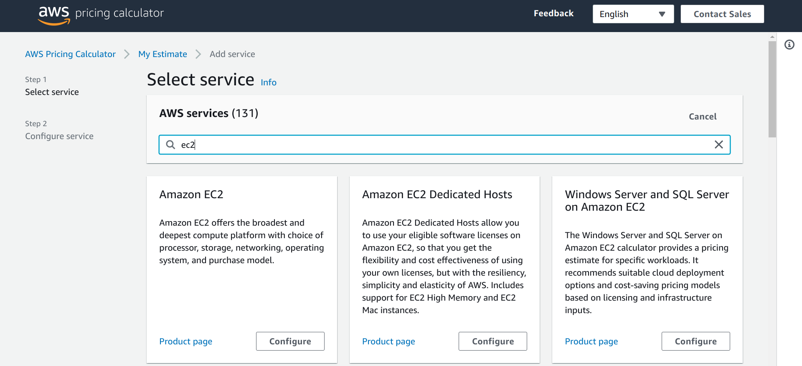 

The page "Configure Amazon EC2" below should have appeared. Select the box "Advance estimate" and then scroll down until you see the heading "EC2 Instances". Continue below.
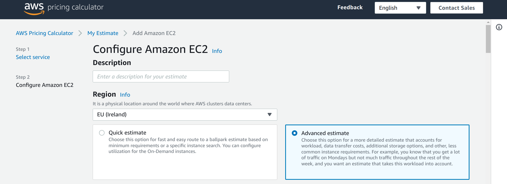 

In the "EC2 Instances (1)" box, in the search box inside, we have typed t2.medium and this made appear the row "t2.medium --- 4 GiB --- etc". Select this row as shown. Continue below.

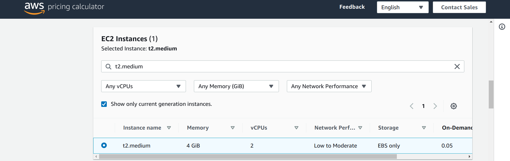 

Scroll down until you see the heading "Pricing strategy" shown below. Select the "On-Demand" option as shown in the page. Continue below.

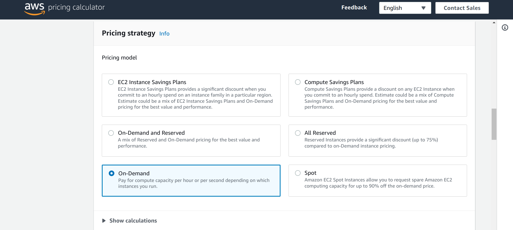 

Scroll down until you see the heading "Amazon Elastic Block Storage (EBS)" shown below. As shown in the page, enter 120 for the option "Storage amount" and set the option "Snapshot Frequency" to "No snapshot storage" with the drop-down menu on the right. Continue below.

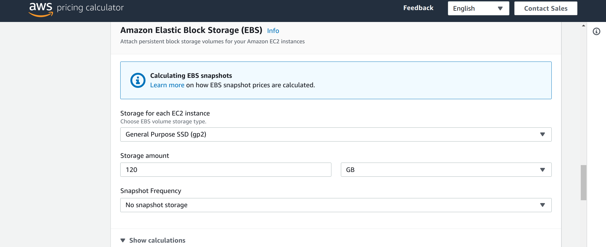 

Scroll down until the very end of the page where you will see your "Amazon EC2 estimate", shown below. 

The costs shown correspond to the *monthly* fees of each service and the total for both services in US dollars.

Click on "Add to my estimate" and continue below.

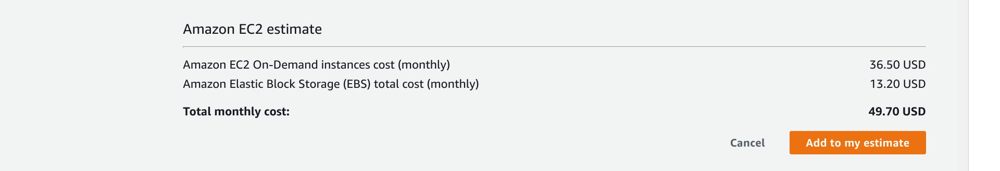 

The page that appears (below) will show your cost estimate for 12 months at the top, and the details of your instance configuration below: Ireland region, intance type t2.medium, 120 EBS storage, On-Demand Pricing strategy.

Note the options at the top: **Add service**, **Add support**, .., and **Share**.

Obviously you can add another service if you click on **Add service**: it will display the page "Select service" where we started (where we type **ec2**), for you to select a service, configure it, and finally add it to your cost estimate and that will bring you back to the page below, showing your cost estimate for 12 months updated and listing the newly added service too. Try it. You can create as many cost estimates as you want. They are deleted after three years. 

The option **Share** is for you to share your cost estimate: to save it (somewhere in AWS servers) and to get the URL (web address) to access it and share it by sharing the URL.  

That is the URL you need to enter in your ACCR application, in the field *Save and Share URL from AWS Pricing Calculator*. 

Click on **Share** and continue below.

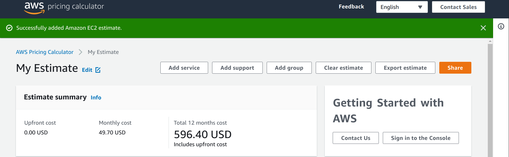 
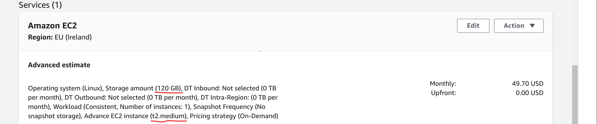 

The two options below will appear, one at a time. 

Click on **Agree and continue** to save your cost estimate. 

Thenk click on **Copy publick link** to get the URL. You can also copy-paste it the usual way. 

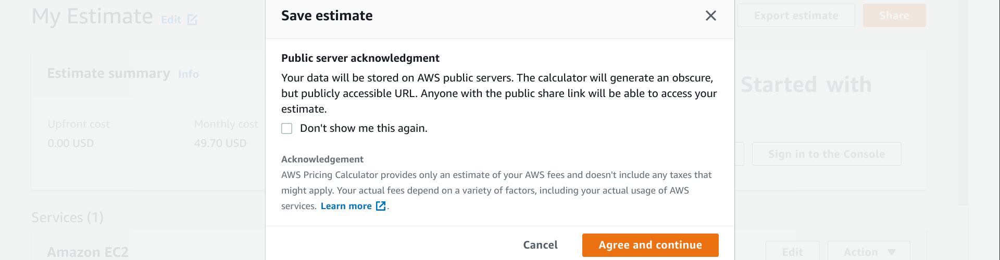 
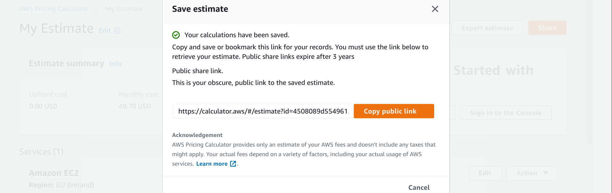 

That's it. 

This is the end of the course "Create Your Own AWS Instance".

We hope you find it useful. 
